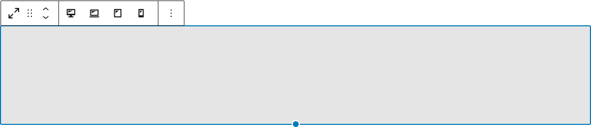

# Spacer Block

The spacer WordPress Gutenberg block package.

The block also includes a default stylesheet that can be imported in a project.




## Installation
Before installing from NPM, make sure to add the sixa enterprise registry and sign in with your NPM user.
```bash
npm i @sixa/wp-bock-spacer
```

or
```bash
npm i @sixa/wp-bock-spacer --save-dev
```
if you are using this library inside an extras plugin.

## Usage
After installing the package, the component and it's reference stylesheets can
be imported from the package.
The packaged block exposes both a `PREFIX` variable and a `registerBlock` function.
You may use `PREFIX` and `name` from the packaged block to use in your own
registration function / loop or you may call `registerBlock` from the package
to rely on the packaged registration function.

```jsx
import * as spacer from '@sixa/wp-bock-spacer';
import '@sixa/wp-bock-spacer/dist/editor.css';

export function registerBlocksFromPackages() {
    forEach( [ spacer ], ( block ) => {
        if ( ! block ) {
            return;
        }

        const { registerBlock } = block;
        registerBlock();
    } );
}
```

Similarly, the stylesheet used in the frontend is available as:
```jsx
import '@sixa/wp-bock-spacer/dist/public.css';
```

or it may be imported in a stylesheet in your project:
```jsx
@import '@sixa/wp-block-spacer/dist/public.css';
```

